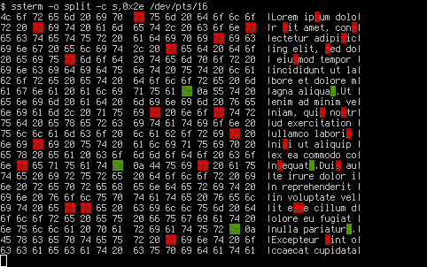
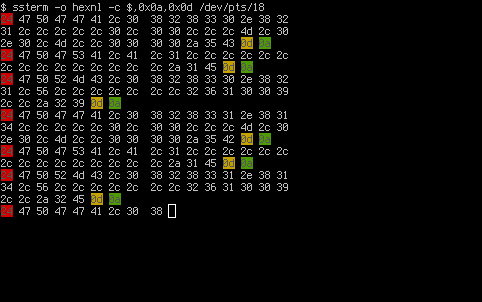

# ssterm v2.0

ssterm is a simple console-based serial port terminal. It features painless
serial port configuration, no dependencies outside of a standard Python 2
installation, and a variety of useful formatting features:

  * output modes
    * raw
    * hexadecimal
    * hexadecimal/ASCII split
  * input modes
    * raw
    * hexadecimal
  * transmit newline remapping (e.g. system newline -> CRLF)
  * receive newline remapping (e.g. CRLF -> system newline)
  * character color coding
  * local character echo

ssterm is written in Python 2, and should work on most *nix platforms. It runs
under both CPython and pypy implementations of Python. Feel free to send any
issues, ideas, or suggestions to vsergeev at gmail or the [GitHub issues
page](https://github.com/vsergeev/ssterm/issues/).

## USAGE

    Usage: /usr/bin/ssterm [options] <serial port device>
    
    ssterm - simple serial-port terminal v2.0
    Vanya A. Sergeev - <vsergeev@gmail.com>
    https://github.com/vsergeev/ssterm
    
    Serial Port Options:
      -b, --baudrate <rate>         Specify baudrate (e.g. 9600, 115200, etc.)
      -d, --databits <number>       Specify number of data bits [5,6,7,8]
      -p, --parity <type>           Specify parity [none, odd, even]
      -t, --stopbits <number>       Specify number of stop bits [1,2]
      -f, --flow-control <type>     Specify flow control [none, rtscts, xonxoff]
    
    Output Formatting Options:
      -o, --output <mode>           Specify output mode
                                      raw       raw (default)
                                      split     hex./ASCII split
                                      splitfull hex./ASCII split with full lines
                                      hex       hex.
                                      hexnl     hex. with newlines
    
      --rx-nl <substitution>        Enable substitution of the specified newline
                                    for the system's newline upon reception
                                      [cr, lf, crlf, crorlf]
    
      -c, --color <list>            Specify comma-delimited list of characters in
                                    ASCII or hex. to color code: A,$,0x0d,0x0a,...
    
    Input Formatting Options:
      -i, --input <mode>            Specify input mode
                                      raw       raw (default)
                                      hex       hex. interpretation
    
      --tx-nl <substitution>        Enable substitution of the system's newline
                                    for the specified newline upon transmission
                                      [none, cr, lf, crlf]
    
      -e, --echo                    Enable local character echo
    
    Miscellaneous:
      -h, --help                    Display this usage/help
      -v, --version                 Display the program's version
    
    
    Quit Escape Character:          Ctrl-]
    
    Default Options:
     baudrate: 115200 | databits: 8 | parity: none | stopbits: 1 | flowctrl: none
     output mode: raw | rx newline: raw | color code: off
     input mode: raw  | tx newline: raw | local echo: off

## LICENSE

ssterm is MIT licensed. See the provided `LICENSE` file.

## USING ssterm

`Ctrl-]` is ssterm's quit escape character.

### Serial Port Options

By default, ssterm opens the specified serial port with 115200 baudrate, 8 data
bits, no parity, 1 stop bit, and no flow control. These serial port settings
can be configured with the `-b, --baudrate`, `-d, --databits`, `-p, --parity`,
`-t, --stopbits`, and `-f, --flow-control` options.

### Output Formatting Options

The `-o, --output` option selects the output mode. In the default `raw` output
mode, received characters are written directly to standard output. In `hex`
output mode, received characters are printed as hexadecimal bytes. In `hexnl`
output mode, received characters are printed as hexadecimal bytes, but newlines
are also interpreted and produce line breaks in the output. In `split` output
mode, received characters are printed in both hexadecimal and ASCII in two
columns, like hexdump's canonical output. `splitfull` output mode functions
like `split` mode, except that it only prints full lines, whereas `split` mode
redraws partial lines as additional bytes are received.

The `--rx-nl` receive newline substitution option enables substituting the
specified newline for the system newline before printing. For example, `--rx-nl
crlf` will substitute any CRLF sequence received for the system's newline (e.g.
LF on Linux) before printing. Receive newline substitution is disabled by
default.

The `-c, --color` option enables color coding the specified comma-delimited
list of characters. The list can contain ASCII characters (e.g. `a,$,A,...`),
as well as hexadecimal bytes (e.g. `0x0a,0xff,...`). Up to seven distinct
colors are assigned sequentially to the specified characters, in the order of:
(Foreground/Background) Black/Red, Black/Green, Black/Yellow, White/Blue,
White/Magenta, Black/Cyan, Black/White.

### Input Formatting Options

The `-i, --input` option selects the input mode. In the default `raw` input
mode, all input characters and control signals are written directly to the
serial port. In the `hex` input mode, consecutive hexadecimal pairs are
converted to bytes and written to the serial port. For example, all four
sequences `aa 55 ee ff`, `0xaa 0x55 0xee 0xff`, `AA,55,EE,FF`, `aa55eeff` will
write the same four bytes (0xaa, 0x55, 0xee, 0xff) to the serial port in the
`hex` input mode.

The `--tx-nl` transmit newline substitution option enables substituting the
system newline for the specified newline before transmission. For example,
`--tx-nl crlf` will substitute the system's newline for a CRLF sequence before
it is written to the serial port. Transmit newline substitution is disabled by
default.

The `-e, --echo` option enables local character echo. Local character echo is
disabled by default.

## Examples

Typical usage with defaults (115200 8N1, no flow control):

    $ ssterm /dev/ttyUSB0

Logging some data:

    $ ssterm /dev/ttyUSB0 > nmea_data.txt

Viewing and logging some data, with the help of tee:

    $ ssterm /dev/ttyUSB0 | tee nmea_data.txt

Piping some data to the serial port, substituting the system newline for CRLF
on transmission:

    $ cat data.txt | ssterm --tx-nl crlf /dev/ttyUSB0

Specific serial port settings (9600 baudrate, odd parity, 2 stop bits), and the
default 8 data bits:

    $ ssterm -b 9600 -p odd -t 2 /dev/ttyUSB0

Substitute the system newline for CRLF on transmission, substitute CRLF for system
newline on reception:

    $ ssterm --tx-nl crlf --rx-nl crlf /dev/ttyUSB0

Normal output mode:

    $ ssterm /dev/ttyUSB0
    $GPGGA,082830.821,,,,,0,00,,,M,0.0,M,,0000*5C
    $GPGSA,A,1,,,,,,,,,,,,,,,*1E
    $GPRMC,082830.821,V,,,,,,,261009,,*29
    $GPGGA,082831.814,,,,,0,00,,,M,0.0,M,,0000*5B
    $GPGSA,A,1,,,,,,,,,,,,,,,*1E
    $GPRMC,082831.814,V,,,,,,,261009,,*2E
    $GPGGA,08

Hexadecimal output mode:

    $ ssterm -o hex /dev/ttyUSB0
    24 47 50 47 47 41 2c 30  38 32 38 33 30 2e 38 32
    31 2c 2c 2c 2c 2c 30 2c  30 30 2c 2c 2c 4d 2c 30
    2e 30 2c 4d 2c 2c 30 30  30 30 2a 35 43 0d 0a 24
    47 50 47 53 41 2c 41 2c  31 2c 2c 2c 2c 2c 2c 2c
    2c 2c 2c 2c 2c 2c 2c 2c  2a 31 45 0d 0a 24 47 50
    52 4d 43 2c 30 38 32 38  33 30 2e 38 32 31 2c 56
    2c 2c 2c 2c 2c 2c 2c 32  36 31 30 30 39 2c 2c 2a
    32 39 0d 0a 24 47 50 47  47 41 2c 30 38 32 38 33
    31 2e 38 31 34 2c 2c 2c  2c 2c 30 2c 30 30 2c 2c
    2c 4d 2c 30 2e 30 2c 4d  2c 2c 30 30 30 30 2a 35
    42 0d 0a 24 47 50 47 53  41 2c 41 2c 31 2c 2c 2c
    2c 2c 2c 2c 2c 2c 2c 2c  2c 2c 2c 2c 2a 31 45 0d
    0a 24 47 50 52 4d 43 2c  30 38 32 38 33 31 2e 38
    31 34 2c 56 2c 2c 2c 2c  2c 2c 2c 32 36 31 30 30
    39 2c 2c 2a 32 45 0d 0a  24 47 50 47 47 41 2c 30
    38 

Split output mode:

    $ ssterm -o split /dev/ttyUSB0
    4c 6f 72 65 6d 20 69 70  73 75 6d 20 64 6f 6c 6f  |Lorem ipsum dolo|
    72 20 73 69 74 20 61 6d  65 74 2c 20 63 6f 6e 73  |r sit amet, cons|
    65 63 74 65 74 75 72 20  61 64 69 70 69 73 69 63  |ectetur adipisic|
    69 6e 67 20 65 6c 69 74  2c 20 73 65 64 20 64 6f  |ing elit, sed do|
    20 65 69 75 73 6d 6f 64  20 74 65 6d 70 6f 72 20  | eiusmod tempor |
    69 6e 63 69 64 69 64 75  6e 74 20 75 74 20 6c 61  |incididunt ut la|
    62 6f 72 65 20 65 74 20  64 6f 6c 6f 72 65 20 6d  |bore et dolore m|
    61 67 6e 61 20 61 6c 69  71 75 61 2e 0a 55 74 20  |agna aliqua..Ut |
    65 6e 69 6d 20 61 64 20  6d 69 6e 69 6d 20 76 65  |enim ad minim ve|
    6e 69 61 6d 2c 20 71 75  69 73 20 6e 6f 73 74 72  |niam, quis nostr|
    75 64 20 65 78 65 72 63  69 74 61 74 69 6f 6e 20  |ud exercitation |
    75 6c 6c 61 6d 63 6f 20  6c 61 62 6f 72 69 73 20  |ullamco laboris |
    6e 69 73 69 20 75 74 20  61 6c 69 71 75 69 70 20  |nisi ut aliquip |
    65 78 20 65 61 20 63 6f  6d 6d 6f 64 6f 20 63 6f  |ex ea commodo co|
    6e 73 65 71 75 61 74 2e  0a 44 75 69 73 20 61 75  |nsequat..Duis au|
    74 65 20 69 72 75 72 65  20 64 6f 6c 6f 72 20 69  |te irure dolor i|
    6e 20 72 65 70 72 65 68  65 6e 64 65 72 69 74 20  |n reprehenderit |
    69 6e 20 76 6f 6c 75 70  74 61 74 65 20 76 65 6c  |in voluptate vel|
    69 74 20 65 73 73 65                              |it esse         |

Split output mode and character color coding:

    $ ssterm -o split -c 0x0A,{,g,0xAE /dev/ttyUSB0

Hexadecimal with newline interpretation output mode and character color coding:

    $ ssterm -o hexnl -c $,0x0a,0x0d /dev/ttyUSB0

